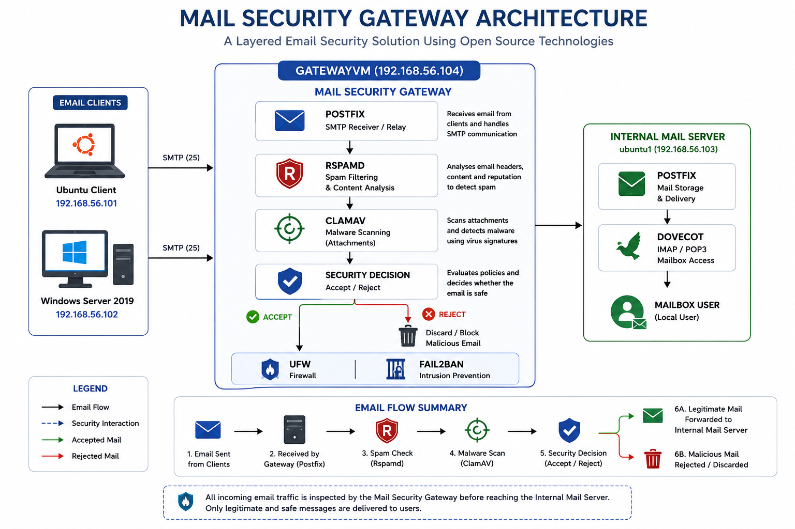

# 🛡 Mail Security Gateway

A layered Mail Security Gateway built using **Postfix**, **Rspamd**, **ClamAV**, **Fail2Ban**, and **UFW** on **Ubuntu Server**.

---

## 📑 Table of Contents

- [Project Overview](#-project-overview)
- [Features](#-features)
- [Architecture](#-architecture)
- [Lab Environment](#-lab-environment)
- [Technologies Used](#-technologies-used)
- [Repository Structure](#-repository-structure)
- [Validation Results](#-validation-results)
- [Documentation](#-documentation)
- [Future Improvements](#-future-improvements)
- [Author](#-author)
---
## 📖 Project Overview

This project demonstrates the design and implementation of a secure Mail Security Gateway using open-source technologies. The gateway receives SMTP traffic, inspects every incoming email, detects spam and malware, applies security policies, and forwards only legitimate messages to the Internal Mail Server.

The implementation was completed as part of an internship project focusing on email security, Linux administration, and threat detection.

---

## ✨ Features

- SMTP Relay
- Spam Detection using Rspamd
- Malware Detection using ClamAV
- Fail2Ban Protection
- UFW Firewall
- Secure Mail Delivery
- EICAR Malware Validation
- SMTP Abuse Protection

---

## 🏗 Architecture

<p align="center">
  
</p>

---

## 🖥 Lab Environment

| Machine | Purpose |
|----------|---------|
| Ubuntu Client | Sends and receives emails |
| GatewayVM | Mail Security Gateway |
| Internal Mail Server | Stores legitimate emails |
| Windows Server 2019 | SMTP testing and validation |

---

## ⚙ Technologies Used

- Ubuntu Server 22.04
- Postfix
- Rspamd
- ClamAV
- Fail2Ban
- UFW
- Oracle VirtualBox
- Linux

---

## 📂 Repository Structure

```text
mail-security-gateway/
├── configs/
├── diagrams/
├── docs/
├── screenshots/
├── LICENSE
└── README.md
```

---

## 🧪 Validation Performed

- Legitimate Email Delivery
- Malware Detection using EICAR
- SMTP Relay Validation
- SMTP Rate Limiting
- Gateway Log Verification
- ClamAV Integration
- Rspamd Filtering
- Fail2Ban Protection

---

## 📄 Documentation

The complete internship report will be available in the **docs/** folder.

---

## 🚀 Future Improvements

- DKIM support
- SPF policy enforcement
- DMARC validation
- TLS hardening
- Dashboard integration
- SIEM log forwarding

---

## 👨‍💻 Author

**Ifat Rahman**

BSc in Information Technology (Cyber Security)

University of Information Technology & Sciences (UITS)

GitHub: https://github.com/irs1247

---

## 📜 License

This project is licensed under the MIT License.
